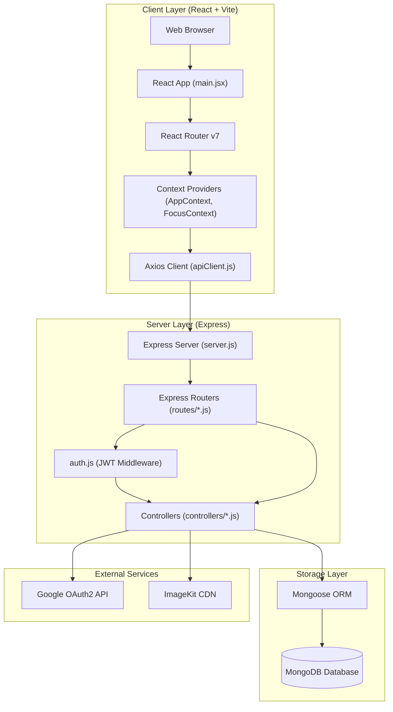
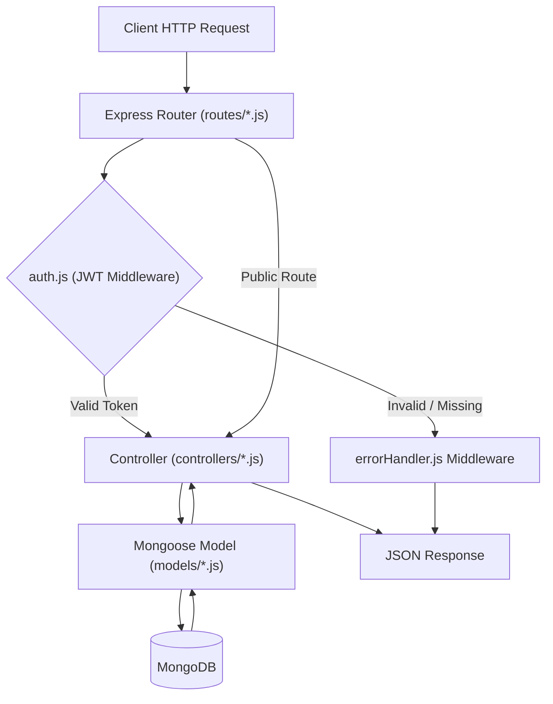
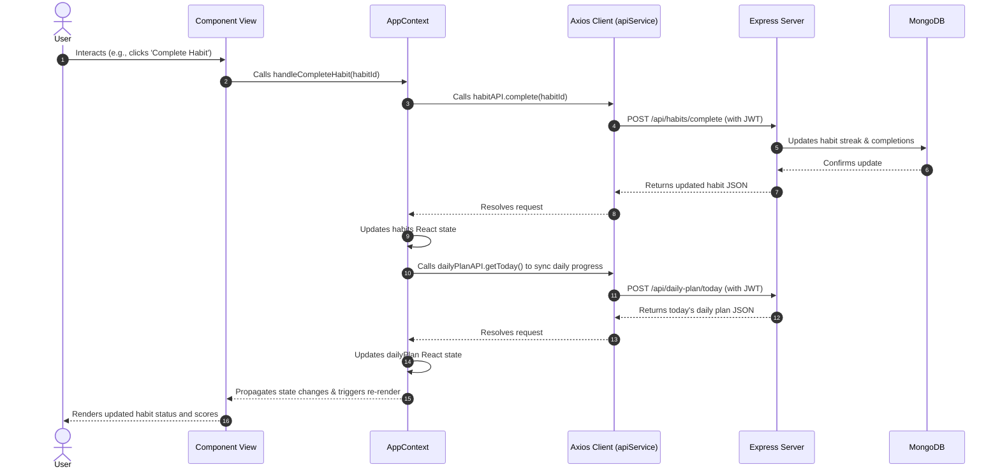
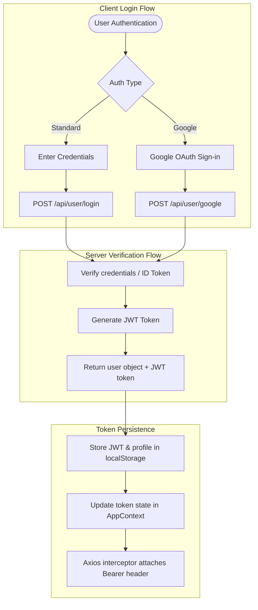
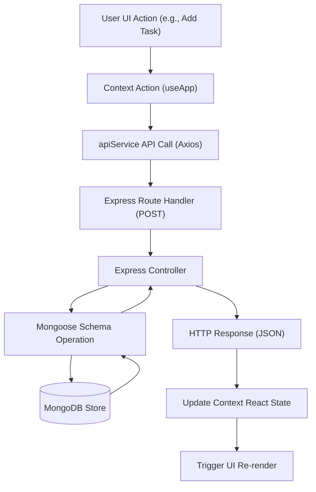
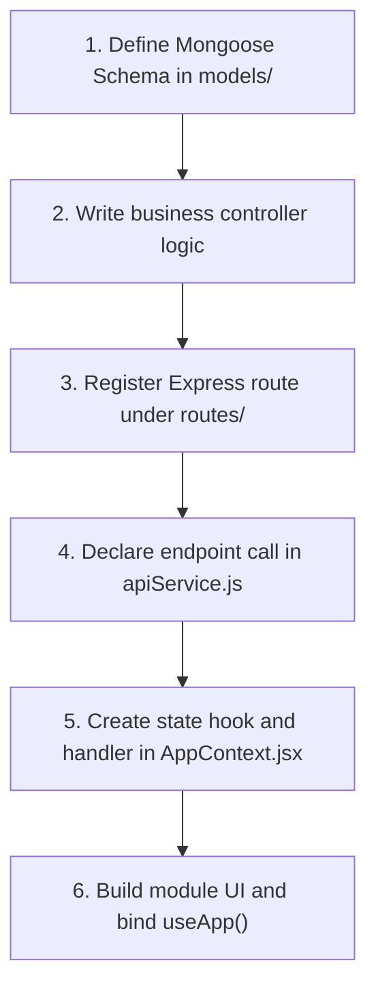

# WiseMindOS Architecture

WiseMindOS is a monorepo application built on the MERN (MongoDB, Express, React, Node.js) stack. The repository separates client-side routing, layout, and state orchestration from server-side business logic and data persistence.

## 1. High-Level System Architecture



* **Client Layer:** A Single Page Application (SPA) built with React 19, Vite, and Tailwind CSS v4. Global state is managed using React Context providers. User credentials, audio settings, and timer states are persisted in `localStorage`.

* **Server Layer:** An Express 5 API server using ES Modules. Business logic is separated into routers, middleware modules, controllers, and Mongoose models.

* **Storage Layer:** Mongoose schemas manage data entities in MongoDB.

* **External Services:** Third-party integrations include Google OAuth for social sign-in, ImageKit for profile media storage/delivery, and Winston for backend event logging.

* **Hosting:** Configured for serverless function deployments via separate `vercel.json` configurations in backend and frontend directories.

---

## 2. Repository Structure

```text
WiseMindOS/
├── .github/          # GitHub action workflows and templates
├── assets/           # Application screenshots and design figures
├── backend/          # Express backend application
│   ├── config/       # Mongoose connections, ImageKit, and Multer initializers
│   ├── controllers/  # Request handlers and business logic
│   ├── middlewares/  # Authentication checks and error handlers
│   ├── models/       # Mongoose schemas and data entities
│   ├── routes/       # Endpoint routing logic
│   ├── tests/        # Backend integration and unit test suite
│   └── utils/        # Shared server utilities (Winston logger)
└── frontend/         # React frontend application
    ├── public/       # Static static assets
    └── src/          # React source code
        ├── api/      # Axios client configuration and service endpoints
        ├── components/ # Reusable UI components
        ├── data/     # Mock data definitions
        ├── layouts/  # App layout wrappers and route guards
        ├── modules/  # Isolated feature rooms
        ├── pages/    # Public page components
        ├── store/    # React Context state layers
        └── utils/    # Client side helpers and utilities
```

### Directory Responsibilities

| Directory | Responsibility |
| :--- | :--- |
| [backend/config](backend/config) | Initializes MongoDB connections via Mongoose, ImageKit API configurations, and Multer file upload settings. |
| [backend/controllers](backend/controllers) | Contains request handlers, database queries, and response compilation logic. |
| [backend/middlewares](backend/middlewares) | Decodes user identity via JWT tokens and catches server-side exceptions. |
| [backend/models](backend/models) | Defines Mongoose schemas for goals, habits, users, tasks, projects, daily plans, and stats. |
| [backend/routes](backend/routes) | Maps endpoints to controllers, injecting route-level middleware where authentication is required. |
| [frontend/src/api](frontend/src/api) | Coordinates requests via Axios, attaching Authorization headers when a JWT token is available. |
| [frontend/src/modules](frontend/src/modules) | Encapsulates specific feature room modules (focus tracker, note-taking library, trackers, future simulator). |
| [frontend/src/store](frontend/src/store) | Dispatches state changes to components using Context providers (`AppContext`, `FocusContext`). |
| [frontend/src/pages](frontend/src/pages) | Manages public route templates (Pricing, Features, Careers, About, Onboarding). |

---

## 3. Backend Architecture

The backend application boots from [server.js](backend/server.js). It initializes the Express application, establishes the MongoDB connection, registers middleware, maps routes, and configures the global error handler.

### Request-Response Processing Pipeline




* **Router Layer:** Incoming HTTP requests matching `/api/*` are captured by routers in [backend/routes/](backend/routes).

* **Middleware Chain:** Standard routes apply the `authUser` middleware in [auth.js](backend/middlewares/auth.js) to decode the authorization header token and populate `req.user.id`.

* **Controller Layer:** Controllers located in [backend/controllers/](backend/controllers) handle input sanitization, database CRUD transactions, and execute third-party operations (like ImageKit profile pictures).

* **Model Layer:** Uses Mongoose schemas in [backend/models/](backend/models) to execute strong-typed MongoDB querying.

---

## 4. Frontend Architecture

The frontend is a React application built with Vite and Tailwind CSS v4.

* **Routing Entry:** React Router v7 routes public components (Landing, Login, Signup) and maps protected paths using a layout wrapper [AppLayout.jsx](frontend/src/layouts/AppLayout.jsx).

* **API Layer:** Axios instance configured in [apiClient.js](frontend/src/api/apiClient.js) automatically injects the active JWT token. Response interceptors handle `401 Unauthorized` responses by purging state and redirecting to `/login`.

* **Feature Modules (Rooms):** Subsystems representing isolated workspaces (such as the focus tracker and library) reside in [frontend/src/modules/](frontend/src/modules). The FutureTwin AI helper in `simulator_room` simulates decisions using local mock datasets with simulated latency.

* **Shared Components:** Atomic layout parts (cards, inputs, skeletons, modal components) are stored in [frontend/src/components/](frontend/src/components).

---

## 5. State Management

The application utilizes a hybrid state management strategy with the React Context API handling global workflows and React hooks (`useState`, `useRef`) managing local UI variables.

* **AppContext:** [AppContext.jsx](frontend/src/store/AppContext.jsx) coordinates global user authentication, core trackers (goals, tasks, projects, habits), notebooks, pages, and productivity/discipline scores.

* **FocusContext:** [FocusContext.jsx](frontend/src/store/FocusContext.jsx) manages active Pomodoro timer states and plays alerts using Web Audio API oscillators.

* **Caching & Persistence:**
  * User profile details (`wisemind_user`), focus timers, and audio volume settings are cached in `localStorage` through `useEffect` loops.

  * Goals, projects, tasks, habits, and daily plan data are fetched dynamically from backend endpoints. `localStorage` is checked as a fallback read during startup, but context actions do not write updates back to it.

### Global State Sync Flow

The sequence diagram below displays how user interactions write updates to the backend and resolve back to the UI state:



---

## 6. Authentication Flow

Authentication supports credential submission (email/username + password) and Google OAuth2 integration.



* **Standard Auth:** Standard credentials submit a request body containing the `identifier` (email or username) and `password` to `/api/user/login`.

* **Google Auth:** Client identity tokens are parsed server-side using Google Auth SDK's `verifyIdToken` at `/api/user/google`.

* **Token Caching:** Upon successful authentication, the backend returns a JSON payload containing the JWT token and user profile object. The client caches this token in `localStorage` under `token` and user profile under `wisemind_user`.

---

## 7. API Design

WiseMindOS implements an RPC-style (Remote Procedure Call) API convention.

> [!NOTE]
> Database operations are routed through the `POST` method. Actions specify intent via path names, and parameters are enclosed inside the request body rather than using URL path variables:
> * **Fetch Collections:** `POST /api/goals/list`
> * **Create Records:** `POST /api/goals/create`
> * **Update Records:** `POST /api/goals/update`
> * **Delete Records:** `POST /api/goals/delete`

This simplifies client payload construction, standardizes request schemas, and keeps Axios endpoints uniform.

---

## 8. Feature Modules

Workspaces are located in [frontend/src/modules/](frontend/src/modules):

* **[focus_room](frontend/src/modules/focus_room):** Houses the Pomodoro distraction-free workspace.

* **[library_room](frontend/src/modules/library_room):** Implements note-taking layouts split into Notebooks and Pages.

* **[simulator_room](frontend/src/modules/simulator_room):** Houses the FutureTwin decision simulator utilizing local mock data responses.

* **[trackers](frontend/src/modules/trackers):** Encapsulates workflows for daily plans, goals, project configurations, and task trackers.

### Adding New Feature Rooms

1. Create a workspace directory in `frontend/src/modules/<new_feature_room>`.
2. Encapsulate room components and styles inside this directory.
3. Import the primary room container into [App.jsx](frontend/src/App.jsx) and map its routing path nested under the `AppLayout` wrapper.

---

## 9. Data Flow

Updates propagate through a unidirectional data flow cycle:



---

## 10. Environment Configuration

The application requires specific environment variables to connect database drivers, verify OAuth credentials, and handle CDN assets.

### Backend Configurations (`backend/.env`)

| Variable | Description |
| :--- | :--- |
| `PORT` | Local network port for backend server execution (default: `4000`). |
| `MONGODB_URI` | Standard MongoDB connection URI. |
| `DB_NAME` | MongoDB database instance name. |
| `JWT_SECRET` | Secret signature string for JWT signing and decoding. |
| `GOOGLE_CLIENT_ID` | OAuth2 Client Identifier for Google identity verification. |
| `GOOGLE_CLIENT_SECRET` | OAuth2 API private secret credentials. |
| `IMAGEKIT_PUBLIC_KEY` | Public key credential for the ImageKit CDN. |
| `IMAGEKIT_PRIVATE_KEY` | Private key credential for the ImageKit CDN. |
| `IMAGEKIT_URL_ENDPOINT` | Root URL endpoint for the ImageKit CDN storage instance. |

### Frontend Configurations (`frontend/.env`)

| Variable | Description |
| :--- | :--- |
| `VITE_BACKEND_URL` | Root URL pointing to the active Express backend server API. |
| `VITE_GOOGLE_CLIENT_ID` | Public OAuth2 Client Identifier for Google login validation. |

---

## 11. Testing Strategy

* **Backend Tests:** Run using the native Node.js test runner (`node --test`). Test specifications are located in [backend/tests/](backend/tests) and verify router/controller responses by mocking database calls.

* **Frontend Tests:** Executed via Vitest using the React Testing Library in a jsdom environment. Tests are co-located in the target directories alongside the files they test (e.g., `AppContext.test.jsx`, `Dashboard.test.jsx`, `helpers.test.js`).

---

## 12. Run & Build Instructions

Because the monorepo does not utilize workspace package orchestrators, frontend and backend folders are executed independently.

### Running Backend Locally

```bash
cd backend
npm install
npm start
```
*Run `npm run server` to start Node with Nodemon hot reloading.*

### Running Frontend Locally

```bash
cd frontend
npm install
npm run dev
```

---

## 13. Architectural Conventions

| Convention | Description |
| :--- | :--- |
| **Folder Isolation** | Features must encapsulate styles, state management, and component parts within their own folders in `src/modules`. |
| **Naming Conventions** | Controllers, routes, and schemas use lowerCamelCase ending with the component type (e.g., `goalController.js`, `goalRoute.js`, `goalModel.js`). |
| **State Consumption** | Components access global values via React Context hooks (`useApp()`, `useFocus()`) rather than invoking direct Axios APIs. |
| **Controller Output** | Route handlers return standard JSON response schemas formatted as `{ success: boolean, data?: any, message?: string }`. |
| **API Endpoints** | Read operations, writes, and deletions utilize the HTTP `POST` method. |
| **State Synchronization** | Changes to authenticated credentials, timers, and volume preferences must immediately sync to `localStorage`. |
| **Error Handling** | Server exceptions are caught using standard `try/catch` wrappers and forwarded via `next(error)` to be formatted and logged by `errorHandler.js`. |

---

## 14. Workflow for Adding Features



---

## 15. Technology Stack

| Layer | Technology |
| :--- | :--- |
| **Frontend Framework** | React 19 (Vite) |
| **Styling** | Tailwind CSS v4 |
| **Routing** | React Router v7 (`react-router-dom`) |
| **Global State** | React Context API |
| **API Client** | Axios |
| **Backend Engine** | Node.js (ES Modules) |
| **Web Server** | Express 5 |
| **Database** | MongoDB |
| **Database ORM** | Mongoose |
| **Authentication** | JSON Web Tokens (JWT) & Google Auth SDK |
| **File Uploads** | Multer & ImageKit |
| **Logging** | Winston Logger |
| **Testing (Backend)** | Native Node.js Test Runner |
| **Testing (Frontend)** | Vitest & React Testing Library |

---

## 16. Future Architectural Improvements

* **Context Splitting:** Divide [AppContext.jsx](frontend/src/store/AppContext.jsx) into domain-specific contexts (e.g., `UserContext`, `TrackerContext`, `NotebookContext`) to improve performance and code organization.

* **Async Caching Layer:** Transition from manual state hooks to a client-side data synchronization and caching library like TanStack Query.

* **API Versioning:** Introduce route namespaces (e.g., `/api/v1/*`) to manage endpoint compatibility.

* **RESTful Compliance:** Transition RPC endpoints to standard RESTful design schemas using distinct HTTP verbs where beneficial.
